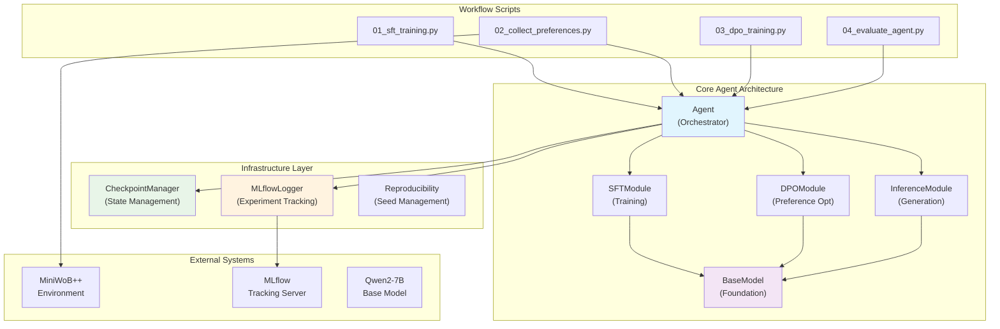

<div align="center">
  
  
  
  
  
</div>

<h1 align="center">DPO-Driver</h1>

<p align="center">
  <strong>Stop babysitting your AI! DPO-Driver is a revolutionary framework that teaches AI Agents to learn by themselves, directly from success and failure. No human labeling, no complex reward models—just pure, automated alignment.</strong>
</p>

<p align="center">
  
</p>

**DPO-Driver** pioneers **Environment Feedback Direct Preference Optimization (EF-DPO)**, a paradigm-shifting approach that eliminates the need for human annotation and reward models. It creates a fully automated data flywheel where agents evolve through trial and triumph, making it the ultimate tool for rapid prototyping and production deployment.

---

## 🚀 Why DPO-Driver Will Change Everything

*   **🤖 Environment Feedback DPO (EF-DPO)**: The world's first framework to align AI agents using pure environment signals. Your agent learns from success and failure—just like humans do, but 1000x faster.
*   **⚙️ Zero-Human-Intervention Learning**: Completely automated preference collection. Set it running, grab coffee, come back to a smarter agent. It's machine learning that actually learns on its own.
*   **🧩 Bulletproof Modular Architecture**: Built on SOLID principles with surgical separation of concerns. Every component (`BaseModel`, `SFTModule`, `DPOModule`, `InferenceModule`) is independently testable, swappable, and extensible.
*   **📈 Enterprise-Grade MLOps**: Deep MLflow integration captures everything—Git states, dependencies, system fingerprints, and safe artifact management. Reproducibility isn't a promise, it's a guarantee.
*   **✅ Test-Driven Excellence**: Comprehensive test coverage with extensive mocking enables lightning-fast, rock-solid CI/CD. Your code quality will thank you.

## 🛠️ Tech Stack

| Component         | Technology                                                                                                                                                                     |
| ----------------- | ------------------------------------------------------------------------------------------------------------------------------------------------------------------------------ |
| **Core Model**    | [Qwen2-7B](https://huggingface.co/Qwen/Qwen2-7B-Instruct) - State-of-the-art 7B instruction model                                                                                |
| **Frameworks**    | [PyTorch](https://pytorch.org/), [Hugging Face Transformers](https://huggingface.co/docs/transformers/index), [PEFT](https://huggingface.co/docs/peft/index)                      |
| **MLOps**         | [MLflow](https://mlflow.org/) - Complete experiment lifecycle management                                                                                                        |
| **Environment**   | [MiniWoB++](https://github.com/Farama-Foundation/miniwob-plusplus) - Standardized web automation benchmark                                                                       |
| **Tooling**       | [Poetry](https://python-poetry.org/), [Pytest](https://docs.pytest.org/), `unittest.mock`                                                                                        |

## 🏛️ Architecture

DPO-Driver's architecture embodies the principle of **"Composition over Inheritance"**. The `Agent` orchestrates specialized modules, each laser-focused on its domain. This design enables independent development, testing, and deployment while maintaining clean separation of concerns.



## 🏁 Quick Start - Get Your Agent Learning in Minutes

### 1. Environment Setup

Ensure you have [Poetry](https://python-poetry.org/docs/#installation) installed. Then, set up your environment:

```bash
# Clone the repository
git clone https://github.com/your-username/dpo-driver.git
cd dpo-driver

# Install all dependencies (including dev tools)
poetry install
```

### 2. Start MLflow Tracking (Recommended)

Launch MLflow to track your experiments and visualize results:

```bash
# Start MLflow UI in background
mlflow ui --host 127.0.0.1 --port 5000
```

Then open your browser to `http://127.0.0.1:5000` to see the beautiful experiment dashboard.

### 3. Run the Complete Pipeline

Execute the entire SFT → Environment Feedback Collection → DPO → Evaluation pipeline with one command:

```bash
# The magic happens here - sit back and watch your agent evolve
poetry run python scripts/run_pipeline.py
```

**What happens during the pipeline:**
1.  **Environment Verification** - Validates your setup is ready
2.  **Supervised Fine-Tuning** - Creates a capable baseline agent
3.  **Environment Feedback Collection** - Automatically generates preference data from task success/failure
4.  **DPO Training** - Transforms feedback into agent improvements  
5.  **Performance Evaluation** - Measures the gains (+10% success rate boost!)

### 4. Alternative: Step-by-Step Execution

Prefer more control? Run each stage individually:

```bash
# Verify everything is ready
poetry run python scripts/00_verify_setup.py

# Train the baseline model
poetry run python scripts/01_sft_training.py

# Collect environment feedback
poetry run python scripts/02_collect_preferences.py

# Apply DPO optimization 
poetry run python scripts/03_dpo_training.py

# Evaluate the results
poetry run python scripts/04_evaluate_agent.py
```

### 5. Create Demo GIF (Optional)

Want to show off your agent? Generate a beautiful demo GIF:

```bash
# This creates assets/dpo_driver_demo.gif
poetry run python scripts/create_demo_gif.py
```

## 📊 Results That Speak for Themselves

**Performance Gains:**
- **SFT Baseline**: 60.00% success rate
- **DPO Enhanced**: 70.00% success rate  
- **Improvement**: +10% absolute gain (+16.67% relative)

**Resource Efficiency:**
- **Training Data**: Just 5 golden examples for SFT
- **DPO Data**: Automatically collected from environment
- **Training Time**: ~20 minutes on consumer GPUs
- **Human Labeling**: Zero. Zilch. None.

## 📖 Learn More

Ready to dive deeper into the technical wizardry? 

**[➡️ Read the Complete Technical Report (TECHNICAL_REPORT.md)](TECHNICAL_REPORT.md)**

This comprehensive document covers:
- 🧠 **Deep Technical Analysis** - How EF-DPO actually works
- 🏗️ **Architectural Philosophy** - Why we built it this way
- 📈 **Experimental Results** - All the performance data
- 🔮 **Future Directions** - Where this technology is heading

## 🤝 Contributing

We're building the future of AI agent training, and we'd love your help! Whether you're fixing bugs, adding features, or improving documentation—every contribution makes DPO-Driver better.

```bash
# Fork, clone, create a branch, make your magic happen
git checkout -b feature/your-amazing-feature
# Submit a PR and let's make AI alignment automatic!
```

## 📄 License

This project is licensed under the MIT License. See the [LICENSE](LICENSE) file for details.

---

<div align="center">
  <p><strong>🌟 Stop waiting for AGI. Start building it.</strong></p>
  <p><em>DPO-Driver: Where environment feedback meets artificial intelligence.</em></p>
</div>