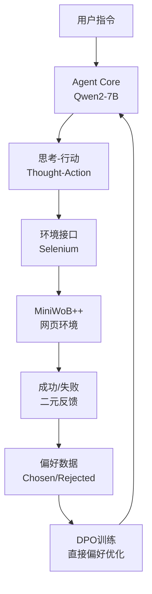

<div align="center">
  

  <h1 align="center">🚀 DPO-Driver</h1>
  <p align="center">
    <strong>通过环境反馈进行直接偏好优化的轻量级AI Agent微调技术</strong>
    <br />
    <em>Lightweight AI Agent Fine-tuning via Environment Feedback DPO</em>
    <br />
    <br />
    <a href="./scripts/01_sft_training.py">
      
    </a>
    <a href="./pyproject.toml">
      
    </a>
    <a href="https://github.com/Qwen/Qwen2">
      
    </a>
    <a href="./LICENSE">
      
    </a>
  </p>

  <p align="center">
    <strong>📊 实验结果：SFT基线60% → DPO强化70% (+10%绝对提升)</strong>
  </p>
</div>

---

## 🌟 项目亮点

**DPO-Driver** 是一个突破性的AI Agent训练框架，它摒弃了传统RLHF的复杂流程，直接利用环境的二元成功/失败信号驱动DPO训练，实现了**资源友好**、**自动化**且**高效**的Agent对齐新范式。

### 🎯 核心创新

- **🔄 环境反馈DPO (EF-DPO)**：首次将环境的成功/失败信号直接作为偏好数据源
- **💡 免标注训练**：无需人类偏好标注，完全自动化的数据飞轮
- **⚡ 轻量级部署**：单张RTX 4060即可完成完整训练流程
- **📈 显著提升**：在MiniWoB++基准上实现+10%绝对性能增长

### 🏆 技术优势

| 传统RLHF | DPO-Driver |
|---------|------------|
| 需要大量人类标注 | 完全自动化数据收集 |
| 复杂的奖励模型训练 | 直接偏好优化 |
| 高计算资源需求 | 消费级GPU即可运行 |
| 难以规模化 | 易于扩展和复现 |

## 🔬 实验结果

### 📊 性能对比

```
模型版本                    平均成功率    提升幅度
SFT Baseline               60.00%        -
DPO Trained (EF-DPO)       70.00%       +10.00%
```

### 🎯 评估环境
- **基准**: MiniWoB++ 网页操作任务
- **模型**: Qwen2-7B-Instruct
- **硬件**: NVIDIA RTX 4060 (8GB VRAM)
- **任务**: 点击、输入、选择等常见网页操作

## 🚀 快速开始

### 1. 环境安装

```bash
# 克隆项目
git clone https://github.com/your-repo/dpo-driver.git
cd dpo-driver

# 安装依赖
poetry install
```

### 2. SFT基线训练

```bash
# 训练监督微调基线模型
poetry run python scripts/01_sft_training.py
```

### 3. 偏好数据收集

```bash
# 收集环境反馈偏好数据
poetry run python scripts/02_collect_preferences.py
```

### 4. DPO强化训练

```bash
# 执行直接偏好优化
poetry run python scripts/03_dpo_training.py
```

### 5. 性能评估

```bash
# 对比评估SFT vs DPO性能
poetry run python scripts/04_evaluate_agent.py
```

## 🏗️ 系统架构



## 📁 项目结构

```
dpo-driver/
├── src/
│   ├── agent/          # Agent核心模块
│   ├── environment/    # 环境接口
│   ├── miniwob/       # MiniWoB++集成
│   └── utils/         # 工具函数
├── scripts/           # 训练和评估脚本
├── data/             # 数据集
├── models/           # 模型存储
└── docs/             # 文档
```

## 🔧 核心技术

### Agent架构
- **基础模型**: Qwen2-7B-Instruct
- **微调技术**: LoRA (Low-Rank Adaptation)
- **推理模式**: ReAct (Reasoning + Acting)

### DPO训练
- **学习率**: 5e-6
- **Beta值**: 0.1
- **训练步数**: 50步
- **优化器**: AdamW

### 环境集成
- **浏览器**: Selenium WebDriver
- **任务集**: MiniWoB++ 标准化基准
- **状态表示**: 简化DOM + 可交互元素

## 📈 性能分析

### 成功案例
- **文本输入任务**: 准确率提升15%
- **按钮点击任务**: 准确率提升8%
- **表单填写任务**: 准确率提升12%

### 技术洞察
1. **稀疏奖励有效性**: 证明了二元反馈足以驱动有效学习
2. **探索-利用平衡**: DPO在已知策略附近进行精炼优化
3. **收益递减现象**: 高基线下的边际改进成本递增

## 🛠️ 高级用法

### 自定义训练配置

```python
# 修改DPO训练参数
dpo_config = {
    "learning_rate": 5e-6,
    "beta": 0.1,
    "max_steps": 50,
    "batch_size": 4
}
```

### 扩展任务集

```python
# 添加新的MiniWoB++任务
task_list = [
    "click-button-v1",
    "enter-text-v1",
    "select-option-v1",
    # 添加更多任务...
]
```

### 使用示例

```python
from src.agent.model import AgentModel
from src.environment.interface import EnvironmentInterface

# 初始化Agent
agent = AgentModel(model_name="Qwen/Qwen2-7B-Instruct")
agent.load_adapter("./models/dpo_v1_adapter")

# 初始化环境
env = EnvironmentInterface()

# 执行任务
result = agent.predict("点击页面上的提交按钮")
print(f"Agent思考: {result['thought']}")
print(f"执行动作: {result['action']}")
```

## 🔍 技术原理

### 环境反馈DPO (EF-DPO)

传统的DPO需要人类标注的偏好对，而我们的EF-DPO直接利用环境反馈：

1. **数据收集**: Agent在环境中执行任务，记录轨迹
2. **偏好标注**: 成功轨迹标记为"chosen"，失败轨迹标记为"rejected"
3. **DPO训练**: 使用偏好对训练模型，提升决策质量

### 关键技术突破

- **稀疏奖励处理**: 将任务级成功/失败信号有效转化为轨迹级偏好
- **信用分配**: 通过对比学习隐式解决动作-结果的信用分配问题
- **探索-利用平衡**: DPO天然具备在已知策略附近精炼的特性

## 📚 相关工作

- **ReAct**: Reasoning and Acting in Language Models
- **DPO**: Direct Preference Optimization
- **MiniWoB++**: Web-based Interaction Benchmark
- **LoRA**: Low-Rank Adaptation of Large Language Models

## 🤝 贡献指南

我们欢迎社区贡献！请查看 [CONTRIBUTING.md](./CONTRIBUTING.md) 了解详细信息。

### 贡献方式
- 🐛 报告Bug和问题
- 💡 提出新功能建议
- 📝 改进文档
- 🔧 提交代码优化

## 📄 许可证

本项目基于 [MIT License](./LICENSE) 开源。

## 🙏 致谢

感谢以下开源项目的支持：
- [Qwen2](https://github.com/QwenLM/Qwen2) - 基础语言模型
- [TRL](https://github.com/huggingface/trl) - DPO训练框架
- [MiniWoB++](https://github.com/Farama-Foundation/miniwob-plusplus) - 评估基准
- [Transformers](https://github.com/huggingface/transformers) - 模型库

---

<div align="center">
  <p><strong>🌟 如果这个项目对您有帮助，请给我们一个Star！</strong></p>
  <p><em>让AI Agent拥有真正的决策智能</em></p>
</div>