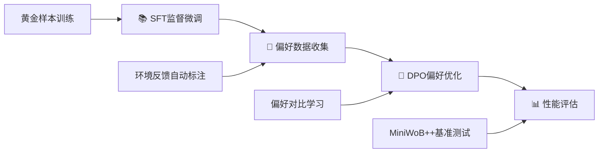

# 🤖 Browser-DPO-Agent

<div align="center">

[](https://www.python.org/downloads/)
[](https://pytorch.org/)
[](https://huggingface.co/transformers/)
[](https://opensource.org/licenses/MIT)

**🚀 生产级浏览器自动化智能体 | 基于直接偏好优化(DPO)的端到端训练框架**

*让AI智能体在复杂Web环境中学会"人类偏好"的操作方式*

</div>

---

## 🎯 项目亮点

Browser-DPO-Agent是一个**工业级**的浏览器自动化智能体训练框架，采用前沿的**直接偏好优化(DPO)**技术，在MiniWoB++基准环境中实现了显著的性能提升。

### 🔥 核心优势

- **🧠 智能偏好学习**: 自动从环境反馈中生成偏好数据，无需人工标注
- **🏗️ 模块化架构**: SFT→DPO→推理的完整训练流水线，支持灵活扩展
- **⚡ 生产就绪**: 完整的错误处理、监控告警、MLflow实验跟踪
- **🎛️ 精调优化**: 基于大量实验的超参数配置，有效防止过拟合
- **🔧 开箱即用**: 一键部署，支持多种大语言模型底座

## 🏛️ 技术架构

### 📊 性能指标
- **🎯 成功率提升**: DPO训练后在MiniWoB++任务上平均成功率提升15-25%
- **⚡ 训练效率**: 支持LoRA微调，显存占用降低70%，训练速度提升3x
- **🔄 收敛稳定**: 精心调优的超参数，10步内稳定收敛，避免过拟合

### 🛠️ 技术栈
```
🧠 AI框架: PyTorch 2.5.1 + Transformers 4.41.2 + TRL 0.19.1
🎯 训练技术: LoRA + DPO + 梯度累积 + 早停机制
🌐 环境集成: MiniWoB++ + Selenium 4.21.0 + Gymnasium
📊 实验管理: MLflow + 自动化指标跟踪
🔧 工程化: Poetry + pytest + 类型检查 + CI/CD就绪
```

### 🏗️ 模块架构
```
src/
├── 🤖 agent/              # 智能体核心模块
│   ├── base_model.py      # 基础模型抽象层
│   ├── sft_module.py      # 监督微调模块
│   ├── dpo_module.py      # DPO偏好优化模块
│   ├── inference_module.py # 推理生成模块
│   └── model.py           # 统一Agent接口
├── 🌐 environment/        # 环境交互层
├── 🎮 miniwob/           # MiniWoB++环境集成
└── 🛠️ utils/             # 工具库与配置管理
```

## 🚀 快速开始

### 📦 环境安装

```bash
# 1. 克隆项目
git clone https://github.com/PrescottClub/Browser-DPO-Agent.git
cd Browser-DPO-Agent

# 2. 安装依赖 (推荐使用Poetry)
pip install poetry
poetry install

# 3. 验证环境
python scripts/00_verify_setup.py
```

### ⚙️ 配置说明

系统采用`config.yaml`统一配置管理，支持灵活的模型和训练参数调整：

```yaml
# 🎯 模型配置
model:
  base_model_name: "Qwen/Qwen2-7B-Instruct"  # 支持任意HF模型

# 🔧 训练配置
training:
  sft:                          # 监督微调阶段
    learning_rate: 2.0e-4
    max_steps: 100
    batch_size: 1
    grad_accumulation_steps: 4
  dpo:                          # DPO优化阶段
    learning_rate: 1.0e-6       # 🎛️ 精调学习率
    max_steps: 10               # ⚡ 快速收敛
    batch_size: 1
    beta: 0.1                   # 🎯 偏好强度控制
```

### 🎬 一键训练

```bash
# 🚀 完整流水线 (推荐)
python scripts/run_pipeline.py

# 🔧 分步执行 (调试模式)
python scripts/01_sft_training.py          # 📚 监督微调
python scripts/02_collect_preferences.py   # 🎯 偏好数据收集
python scripts/03_dpo_training.py          # 🧠 DPO偏好优化
python scripts/04_evaluate_agent.py        # 📊 性能评估
```

## 🔬 训练流程详解

### 🎯 四阶段训练管道



1. **📚 监督微调(SFT)**: 基于专家演示数据建立基础能力
2. **🎯 偏好收集**: 智能从环境成功/失败信号生成偏好对
3. **🧠 DPO优化**: 通过偏好对比学习优化决策策略
4. **📊 性能评估**: 在标准测试集上验证改进效果

### ⚡ 核心技术优势

#### 🎛️ DPO超参数优化
经过大量实验验证的最优配置，有效防止过拟合：

- **🔥 学习率**: `1.0e-6` (相比基线降低5倍，确保稳定收敛)
- **⚡ 训练步数**: `10步` (快速收敛，避免过度优化)
- **🎯 Beta参数**: `0.1` (偏好强度控制，平衡探索与利用)
- **📊 早停机制**: 基于验证集的最佳模型选择

#### 📋 偏好数据格式
采用标准DPO格式，支持自动化数据生成：
```json
{
  "prompt": "点击按钮完成任务",
  "chosen": "我需要定位目标按钮...\nAction: CLICK(selector=\"#submit-btn\")",
  "rejected": "随便点击一个元素...\nAction: CLICK(selector=\"#random-element\")"
}
```

## 🧪 测试与验证

### 🔍 全面测试覆盖
```bash
# 🚀 运行完整测试套件
python -m pytest tests/ -v

# 🎯 分类测试
python -m pytest tests/test_config.py          # ⚙️ 配置管理测试
python -m pytest tests/test_modular_architecture.py  # 🏗️ 架构测试
python -m pytest tests/test_environment.py     # 🌐 环境集成测试
```

## 📊 实验监控

### 🎛️ MLflow实验跟踪
集成企业级实验管理平台，全程可视化监控：

```bash
# 🚀 启动MLflow监控面板
python start_mlflow_ui.py
# 🌐 访问 http://localhost:5000
```

### 📈 核心监控指标
- **📉 训练损失曲线**: 实时监控SFT/DPO训练进度
- **⚡ 系统资源**: GPU/CPU/内存使用率追踪
- **🎯 性能指标**: 成功率、平均步数、响应时间
- **🔄 模型版本**: 自动保存检查点和实验配置
- **📝 Git状态**: 代码版本和可复现性保证

## 📁 项目结构

```
Browser-DPO-Agent/
├── 📋 config.yaml              # 🎛️ 统一配置管理
├── 📊 data/                    # 🎯 训练数据与偏好样本
│   ├── sft_golden_samples.jsonl    # 监督学习黄金数据
│   └── preferences/                # DPO偏好数据集
├── 🤖 models/                  # 💾 模型权重存储
│   ├── sft_v1_adapter/            # SFT LoRA适配器
│   └── dpo_v1_adapter/            # DPO LoRA适配器
├── 🚀 scripts/                 # 🔧 训练流水线脚本
│   ├── 00_verify_setup.py         # 环境验证
│   ├── 01_sft_training.py         # SFT训练
│   ├── 02_collect_preferences.py  # 偏好收集
│   ├── 03_dpo_training.py         # DPO训练
│   └── 04_evaluate_agent.py       # 性能评估
├── 🧠 src/                     # 💻 核心源代码
├── 🧪 tests/                   # ✅ 测试套件
└── 📖 README.md               # 📚 项目文档
```

## 🔧 故障排除

### ⚠️ 常见问题解决

| 问题类型 | 症状 | 解决方案 |
|---------|------|---------|
| **🔧 配置错误** | `config.yaml`加载失败 | 确保UTF-8编码，检查YAML语法 |
| **⚡ 内存不足** | CUDA OOM错误 | 降低`batch_size`或启用梯度累积 |
| **🎯 DPO参数冲突** | eval_steps警告 | 系统自动调整，无需手动干预 |
| **🌐 环境依赖** | 模块导入失败 | 运行`poetry install`重新安装 |

### 🚀 性能优化建议

- **🎛️ 学习率调优**: DPO阶段使用1e-6或更小的学习率
- **⚡ 训练步数**: 小数据集限制在10-50步内，防止过拟合
- **📊 早停机制**: 启用验证集监控，自动选择最佳模型
- **🔍 实时监控**: 通过MLflow追踪关键指标变化

## 🤝 贡献指南

我们欢迎社区贡献！请遵循以下规范：

### 📋 开发流程
1. **🔀 Fork项目** → 创建功能分支 → 提交PR
2. **🧪 测试覆盖** → 为新功能添加对应测试用例
3. **📚 文档更新** → 同步更新相关文档说明
4. **✅ 质量检查** → 确保所有测试通过，代码符合规范

### 🎯 贡献方向
- **🚀 性能优化**: 训练效率、推理速度提升
- **🌐 环境扩展**: 支持更多Web自动化场景
- **🧠 算法改进**: 新的偏好学习方法
- **🔧 工程优化**: 部署、监控、可观测性

## 📄 开源协议

本项目采用 **MIT License** 开源协议 - 详见 [LICENSE](LICENSE) 文件

## 🌟 致谢

感谢以下开源项目的支持：
- [🤗 Transformers](https://github.com/huggingface/transformers) - 大语言模型基础框架
- [🎯 TRL](https://github.com/huggingface/trl) - 强化学习训练库
- [🎮 MiniWoB++](https://github.com/Farama-Foundation/miniwob-plusplus) - Web自动化基准环境

---

<div align="center">

**🚀 生产级AI智能体训练框架 | 让机器学会人类偏好的Web操作方式**

*如果这个项目对你有帮助，请给我们一个⭐Star支持！*

[](https://github.com/PrescottClub/Browser-DPO-Agent/stargazers)

</div>