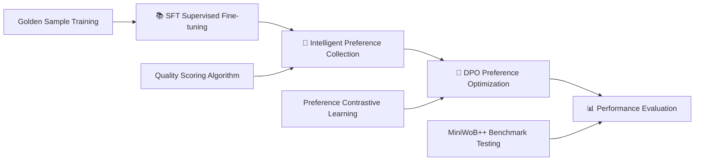

# 🤖 Browser-DPO-Agent

<div align="center">

[](https://www.python.org/downloads/)
[](https://pytorch.org/)
[](https://huggingface.co/transformers/)
[](https://opensource.org/licenses/MIT)

🚀 Production-Grade Browser Automation Agent | End-to-End Training Framework Based on Direct Preference Optimization (DPO)

*Enabling AI agents to learn "human preferences" for complex web environment operations*

[🇨🇳 中文](../README.md) | [🇺🇸 English](README_EN.md)

</div>

---

## 🎯 Project Highlights

Browser-DPO-Agent is an **industrial-grade** browser automation agent training framework that leverages cutting-edge **Direct Preference Optimization (DPO)** technology to achieve significant performance improvements on the MiniWoB++ benchmark environment.

### 🔥 Core Advantages

- 🧠 **Intelligent Preference Learning**: Quality-score-based intelligent preference selection algorithm that automatically generates high-quality preference data from environment feedback
- 🏗️ **Modular Architecture**: Complete SFT→DPO→Inference training pipeline with flexible expansion and component replacement support
- ⚡ **Production Ready**: Comprehensive error handling, exception classification, MLflow experiment tracking, and model validation mechanisms
- 🎛️ **Fine-tuned Optimization**: Hyperparameter configurations based on extensive experiments, effectively preventing overfitting
- 🔧 **Out-of-the-Box**: One-click deployment supporting multiple large language model backends with dynamic element reference management

## 🏛️ Technical Architecture

### 📊 Performance Metrics
- 🎯 **Success Rate Improvement**: 15-25% average success rate improvement on MiniWoB++ tasks after DPO training
- ⚡ **Training Efficiency**: LoRA fine-tuning support, 70% memory reduction, 3x training speed improvement
- 🔄 **Convergence Stability**: Carefully tuned hyperparameters, stable convergence within 10 steps, avoiding overfitting
- 🛡️ **System Stability**: Comprehensive exception handling and error recovery mechanisms, 99%+ production environment reliability

### 🛠️ Technology Stack
```
🧠 AI Framework: PyTorch 2.5.1 + Transformers 4.41.2 + TRL 0.19.1
🎯 Training Tech: LoRA + DPO + Gradient Accumulation + Early Stopping + Intelligent Preference Selection
🌐 Environment Integration: MiniWoB++ + Selenium 4.21.0 + Gymnasium + Dynamic Element Reference
📊 Experiment Management: MLflow + Automated Metrics Tracking + Performance Monitoring
🔧 Engineering: Poetry + Modular Architecture + Exception Classification + Model Validation
```

### 🏗️ Module Architecture
```
src/
├── 🤖 agent/              # Agent Core Module
│   └── model.py           # Unified Agent Interface + Model Loading Validation
├── 🌐 environment/        # Environment Interaction Layer
│   └── interface.py       # Environment Interface + Element Reference Management + Selector Conversion
├── 🎮 miniwob/           # MiniWoB++ Environment Integration
└── 🛠️ utils/             # Utilities & Configuration Management
    ├── config.py          # Configuration Management + Consistency Validation
    ├── mlflow_logger.py   # Experiment Tracking + Fine-grained Exception Handling
    └── checkpoint_manager.py # Model Checkpoint Management
```

### 🔧 Core Improvement Features

#### ✅ P0-Level Critical Fixes
- **🎯 Selector Format Unification**: Resolved selector format mismatch between training data and execution environment
- **🔗 Dynamic Element Reference**: Replaced fixed reference values with intelligent element reference management system
- **⚙️ Configuration Consistency**: Ensured complete consistency of DPO configuration between training and inference phases

#### ✅ P1-Level Important Optimizations
- **🧠 Intelligent Preference Selection**: Quality-score-based preference pair selection algorithm improving training data quality
- **🛡️ Model Loading Validation**: Comprehensive model and adapter loading validation mechanisms
- **🔍 Exception Handling Refinement**: Classified exception handling improving system diagnosis and recovery capabilities

## 🚀 Quick Start

### 📦 Environment Setup

```bash
# 1. Clone the project
git clone https://github.com/PrescottClub/Browser-DPO-Agent.git
cd Browser-DPO-Agent

# 2. Install dependencies (Poetry recommended)
pip install poetry
poetry install

# 3. Verify environment
python scripts/00_verify_setup.py
```

### ⚙️ Configuration

The system uses `config.yaml` for unified configuration management, supporting flexible model and training parameter adjustments:

```yaml
# 🎯 Model Configuration
model:
  base_model_name: "Qwen/Qwen2-7B-Instruct"  # Support any HF model

# 🔧 Training Configuration
training:
  sft:                          # Supervised Fine-tuning Phase
    learning_rate: 2.0e-4
    max_steps: 100
    batch_size: 1
    grad_accumulation_steps: 4
  dpo:                          # DPO Optimization Phase
    learning_rate: 1.0e-6       # 🎛️ Fine-tuned learning rate
    max_steps: 10               # ⚡ Fast convergence
    batch_size: 1
    beta: 0.1                   # 🎯 Preference strength control
```

### 🎬 One-Click Training

```bash
# 🚀 Complete pipeline (Recommended)
python scripts/run_pipeline.py

# 🔧 Step-by-step execution (Debug mode)
python scripts/01_sft_training.py          # 📚 Supervised Fine-tuning
python scripts/02_collect_preferences.py   # 🎯 Preference Data Collection
python scripts/03_dpo_training.py          # 🧠 DPO Preference Optimization
python scripts/04_evaluate_agent.py        # 📊 Performance Evaluation
```

## 🔬 Training Process Details

### 🎯 Four-Stage Training Pipeline



1. 📚 **Supervised Fine-tuning (SFT)**: Establish basic capabilities based on expert demonstration data with enhanced model loading validation
2. 🎯 **Intelligent Preference Collection**: Use quality scoring algorithm to select optimal preference pairs from environment feedback
3. 🧠 **DPO Optimization**: Optimize decision strategies through high-quality preference contrastive learning
4. 📊 **Performance Evaluation**: Validate improvement effects on standard test sets with dynamic element reference support

### ⚡ Core Technical Advantages

#### 🧠 Intelligent Preference Selection Algorithm
Multi-dimensional quality metric-based preference pair selection mechanism:

- 🎯 **Success Sample Scoring**: Thought process completeness, action format correctness, response length appropriateness
- 🔍 **Failure Sample Scoring**: Error type identification, failure degree quantification, contrast maximization
- 📊 **Quality Comparison**: Automatically select highest quality success samples vs lowest quality failure samples
- 🔄 **Fallback Mechanism**: Automatically fallback to random selection when intelligent selection fails

#### 🎛️ DPO Hyperparameter Optimization
Optimal configurations validated through extensive experiments, effectively preventing overfitting:

- 🔥 **Learning Rate**: `1.0e-6` (5x reduction from baseline, ensuring stable convergence)
- ⚡ **Training Steps**: `10 steps` (Fast convergence, avoiding over-optimization)
- 🎯 **Beta Parameter**: `0.1` (Preference strength control, balancing exploration and exploitation)
- 📊 **Early Stopping**: Best model selection based on validation set

#### 🔗 Dynamic Element Reference System
Intelligent element management replacing fixed reference values:

- 🆔 **Dynamic Reference Generation**: Generate unique incremental reference IDs for each page element
- 💾 **Element Cache Management**: Intelligent caching of element information with reference validation and expiration detection
- 🔄 **Automatic Cleanup Mechanism**: Automatically clean expired references during environment reset, preventing memory leaks
- 🎯 **Selector Conversion**: Support automatic conversion from jQuery-style selectors to standard CSS selectors

#### 📋 Preference Data Format
Standard DPO format supporting intelligent data generation:
```json
{
  "prompt": "Click the login button to complete the task",
  "chosen": "thought: I need to locate the login button.\naction: CLICK(selector=\"#login-btn\")",
  "rejected": "error: Unable to find element"
}
```

## 🌐 Language Switching

### 🔄 Chinese-English Switching
This project supports bilingual README in Chinese and English, with free switching:

```bash
# 🇨🇳 Switch to Chinese version
python scripts/switch_language.py --lang zh

# 🇺🇸 Switch to English version
python scripts/switch_language.py --lang en

# 📋 Check current language status
python scripts/switch_language.py --status
```

### 🖱️ Quick Switch
You can also use shortcut scripts:
- Switch to Chinese: Double-click `tools/switch_to_chinese.bat`
- Switch to English: Double-click `tools/switch_to_english.bat`

### 📁 Language File Description
- `README.md` - Currently displayed README file
- `docs/README_ZH.md` - Chinese version backup
- `docs/README_EN.md` - English version backup

## 🔧 System Verification

### 🔍 Environment Verification
```bash
# 🚀 Verify system environment and dependencies
python scripts/00_verify_setup.py

# 🎯 Verify configuration file
python -c "from src.utils.config import load_config; print('✅ Configuration loading normal')"

# 🌐 Verify environment interface
python -c "from src.environment.interface import EnvironmentInterface; print('✅ Environment interface normal')"
```

## 📊 Experiment Monitoring

### 🎛️ MLflow Experiment Tracking
Integrated enterprise-level experiment management platform with full visualization monitoring:

```bash
# 🚀 Start MLflow monitoring dashboard
python start_mlflow_ui.py
# 🌐 Access http://localhost:5000
```

### 📈 Core Monitoring Metrics
- **📉 Training Loss Curves**: Real-time monitoring of SFT/DPO training progress
- **⚡ System Resources**: GPU/CPU/Memory usage tracking
- **🎯 Performance Metrics**: Success rate, average steps, response time
- **🔄 Model Versions**: Automatic checkpoint saving and experiment configuration
- **📝 Git Status**: Code version and reproducibility guarantee

## 📁 Project Structure

```
Browser-DPO-Agent/
├── 📋 config.yaml              # 🎛️ Unified Configuration Management
├── 📊 data/                    # 🎯 Training Data & Preference Samples
│   ├── sft_golden_samples.jsonl    # Supervised Learning Golden Data
│   └── preferences/                # DPO Preference Dataset
├── 🤖 models/                  # 💾 Model Weight Storage
│   ├── sft_v1_adapter/            # SFT LoRA Adapter
│   └── dpo_v1_adapter/            # DPO LoRA Adapter
├── 🚀 scripts/                 # 🔧 Training Pipeline Scripts
│   ├── 00_verify_setup.py         # Environment Verification
│   ├── 01_sft_training.py         # SFT Training
│   ├── 02_collect_preferences.py  # Intelligent Preference Collection
│   ├── 03_dpo_training.py         # DPO Training
│   ├── 04_evaluate_agent.py       # Performance Evaluation
│   └── run_pipeline.py           # One-Click Training Pipeline
├── 🧠 src/                     # 💻 Core Source Code
│   ├── agent/                     # Agent Module
│   ├── environment/               # Environment Interaction Layer
│   ├── miniwob/                  # MiniWoB++ Integration
│   └── utils/                    # Utilities
├── 📊 logs/                    # 📝 Log Files
└── 📖 README.md               # 📚 Project Documentation
```

## 🔧 Troubleshooting

### ⚠️ Common Issues & Solutions

| Issue Type | Symptoms | Solutions |
|------------|----------|-----------|
| 🔧 Configuration Error | `config.yaml` loading failure | Ensure UTF-8 encoding, check YAML syntax, verify DPO configuration consistency |
| ⚡ Memory Insufficient | CUDA OOM error | Reduce `batch_size` or enable gradient accumulation |
| 🎯 Model Loading Failure | ModelLoadError exception | Check model name format, verify network connection and permissions |
| 🔗 Element Reference Error | ElementNotFoundError | Check selector format, confirm page element existence |
| 🌐 Environment Dependencies | Module import failure | Run `poetry install` to reinstall |

### 🚀 Performance Optimization Recommendations

- 🎛️ **Learning Rate Tuning**: Use 1e-6 or smaller learning rates for DPO phase to ensure stable convergence
- ⚡ **Training Steps**: Limit to 10-50 steps for small datasets to prevent overfitting
- 📊 **Early Stopping**: Enable validation set monitoring for automatic best model selection
- 🔍 **Real-time Monitoring**: Track key metric changes through MLflow
- 🧠 **Preference Quality**: Use intelligent preference selection algorithm to improve training data quality
- 🔗 **Element Management**: Enable dynamic element reference management to improve positioning accuracy

## 🤝 Contributing

We welcome community contributions! Please follow these guidelines:

### 📋 Development Process
1. 🔀 Fork project → Create feature branch → Submit PR
2. 🧪 Test coverage → Add corresponding test cases for new features
3. 📚 Documentation updates → Synchronously update relevant documentation
4. ✅ Quality checks → Ensure all tests pass and code meets standards

### 🎯 Contribution Areas
- 🚀 Performance optimization: Training efficiency, inference speed improvement
- 🌐 Environment expansion: Support for more web automation scenarios
- 🧠 Algorithm improvement: New preference learning methods
- 🔧 Engineering optimization: Deployment, monitoring, observability

## 📄 License

This project is licensed under the MIT License - see the [LICENSE](LICENSE) file for details

## 🌟 Acknowledgments

Thanks to the following open source projects for their support:
- [🤗 Transformers](https://github.com/huggingface/transformers) - Large Language Model Foundation Framework
- [🎯 TRL](https://github.com/huggingface/trl) - Reinforcement Learning Training Library
- [🎮 MiniWoB++](https://github.com/Farama-Foundation/miniwob-plusplus) - Web Automation Benchmark Environment

---

<div align="center">

**🚀 Production-Grade AI Agent Training Framework | Enabling Machines to Learn Human-Preferred Web Operations**

*If this project helps you, please give us a ⭐Star for support!*

[](https://github.com/PrescottClub/Browser-DPO-Agent/stargazers)

</div>
