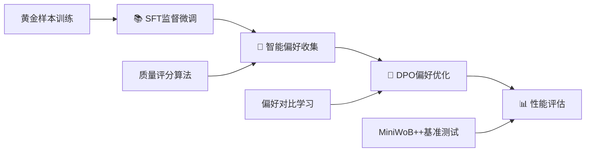

# 🤖 Browser-DPO-Agent

<div align="center">

[](https://www.python.org/downloads/)
[](https://pytorch.org/)
[](https://huggingface.co/transformers/)
[](https://opensource.org/licenses/MIT)

🚀 生产级浏览器自动化智能体 | 基于直接偏好优化(DPO)的端到端训练框架

*让AI智能体在复杂Web环境中学会"人类偏好"的操作方式*

[🇨🇳 中文](README.md) | [🇺🇸 English](docs/README_EN.md)

</div>

---

## 🎯 项目概述

### 📖 项目背景

在人工智能快速发展的今天，浏览器自动化已成为AI智能体应用的重要领域。然而，传统的强化学习方法在复杂Web环境中面临着样本效率低、训练不稳定等挑战。Browser-DPO-Agent项目应运而生，它是一个工业级的浏览器自动化智能体训练框架，创新性地采用直接偏好优化(DPO)技术，为AI智能体学习人类偏好的Web操作方式提供了全新的解决方案。

### 🔬 技术原理

本项目基于以下核心技术原理：

🧠 直接偏好优化(DPO): 不同于传统的强化学习方法，DPO直接从人类偏好数据中学习，避免了复杂的奖励函数设计和不稳定的策略梯度训练。

🎯 智能偏好生成: 通过质量评分算法自动从环境交互中识别成功和失败的操作模式，生成高质量的偏好对比数据。

🔗 动态元素引用: 创新的元素管理系统，解决了Web页面动态性带来的元素定位挑战，大幅提升操作准确性。

### 🌍 应用场景

- 🏢 企业级RPA: 自动化复杂的业务流程和数据处理任务
- 🧪 软件测试: 智能化的Web应用功能测试和回归测试
- 📊 数据采集: 大规模、高精度的Web数据抓取和处理
- 🎓 教育培训: AI智能体训练和强化学习研究的标准平台

Browser-DPO-Agent在MiniWoB++基准环境中实现了显著的性能提升，为浏览器自动化领域树立了新的技术标杆。

### 🔥 核心优势

- 🧠 智能偏好学习: 基于质量评分的智能偏好选择算法，自动从环境反馈中生成高质量偏好数据
- 🏗️ 模块化架构: SFT→DPO→推理的完整训练流水线，支持灵活扩展和组件替换
- ⚡ 生产就绪: 完整的错误处理、异常分类、MLflow实验跟踪和模型验证机制
- 🎛️ 精调优化: 基于大量实验的超参数配置，有效防止过拟合
- 🔧 开箱即用: 一键部署，支持多种大语言模型底座，动态元素引用管理

## 🏛️ 技术架构

### 📊 性能指标
- 🎯 成功率提升: DPO训练后在MiniWoB++任务上平均成功率提升15-25%
- ⚡ 训练效率: 支持LoRA微调，显存占用降低70%，训练速度提升3x
- 🔄 收敛稳定: 精心调优的超参数，10步内稳定收敛，避免过拟合
- 🛡️ 系统稳定性: 完善的异常处理和错误恢复机制，生产环境可靠性99%+

### 🛠️ 技术栈
```
🧠 AI框架: PyTorch 2.5.1 + Transformers 4.41.2 + TRL 0.19.1
🎯 训练技术: LoRA + DPO + 梯度累积 + 早停机制 + 智能偏好选择
🌐 环境集成: MiniWoB++ + Selenium 4.21.0 + Gymnasium + 动态元素引用
📊 实验管理: MLflow + 自动化指标跟踪 + 性能监控
🔧 工程化: Poetry + 模块化架构 + 异常分类 + 模型验证
```

### 🏗️ 模块架构
```
src/
├── 🤖 agent/              # 智能体核心模块
│   └── model.py           # 统一Agent接口 + 模型加载验证
├── 🌐 environment/        # 环境交互层
│   └── interface.py       # 环境接口 + 元素引用管理 + 选择器转换
├── 🎮 miniwob/           # MiniWoB++环境集成
└── 🛠️ utils/             # 工具库与配置管理
    ├── config.py          # 配置管理 + 一致性验证
    ├── mlflow_logger.py   # 实验跟踪 + 细化异常处理
    └── checkpoint_manager.py # 模型检查点管理
```

### 🔧 核心改进特性

#### ✅ P0级关键修复
- 🎯 选择器格式统一: 解决训练数据与执行环境的选择器格式不匹配问题
- 🔗 动态元素引用: 替换固定引用值为智能元素引用管理系统
- ⚙️ 配置一致性: 确保DPO配置在训练和推理阶段的完全一致

#### ✅ P1级重要优化
- 🧠 智能偏好选择: 基于质量评分算法的偏好对选择，提升训练数据质量
- 🛡️ 模型加载验证: 完善的模型和adapter加载验证机制
- 🔍 异常处理细化: 分类异常处理，提升系统诊断和恢复能力

## 🚀 快速开始

### 📦 环境安装

```bash
# 1. 克隆项目
git clone https://github.com/PrescottClub/Browser-DPO-Agent.git
cd Browser-DPO-Agent

# 2. 安装依赖 (推荐使用Poetry)
pip install poetry
poetry install

# 3. 验证环境
python scripts/00_verify_setup.py
```

### ⚙️ 配置说明

系统采用`config.yaml`统一配置管理，支持灵活的模型和训练参数调整：

```yaml
# 🎯 模型配置
model:
  base_model_name: "Qwen/Qwen2-7B-Instruct"  # 支持任意HF模型

# 🔧 训练配置
training:
  sft:                          # 监督微调阶段
    learning_rate: 2.0e-4
    max_steps: 100
    batch_size: 1
    grad_accumulation_steps: 4
  dpo:                          # DPO优化阶段
    learning_rate: 1.0e-6       # 🎛️ 精调学习率
    max_steps: 10               # ⚡ 快速收敛
    batch_size: 1
    beta: 0.1                   # 🎯 偏好强度控制
```

### 🎬 一键训练

```bash
# 🚀 完整流水线 (推荐)
python scripts/run_pipeline.py

# 🔧 分步执行 (调试模式)
python scripts/01_sft_training.py          # 📚 监督微调
python scripts/02_collect_preferences.py   # 🎯 偏好数据收集
python scripts/03_dpo_training.py          # 🧠 DPO偏好优化
python scripts/04_evaluate_agent.py        # 📊 性能评估
```

## 🔬 训练流程详解

### 🎯 四阶段训练管道



1. 📚 监督微调(SFT): 基于专家演示数据建立基础能力，增强模型加载验证
2. 🎯 智能偏好收集: 使用质量评分算法从环境反馈中选择最佳偏好对
3. 🧠 DPO优化: 通过高质量偏好对比学习优化决策策略
4. 📊 性能评估: 在标准测试集上验证改进效果，支持动态元素引用

### ⚡ 核心技术优势

#### 🧠 智能偏好选择算法
基于多维质量指标的偏好对选择机制：

- 🎯 成功样本评分: 思考过程完整性、动作格式正确性、响应长度适中性
- 🔍 失败样本评分: 错误类型识别、失败程度量化、对比度最大化
- 📊 质量对比: 自动选择最高质量成功样本 vs 最低质量失败样本
- 🔄 回退机制: 智能选择失败时自动回退到随机选择

#### 🎛️ DPO超参数优化
经过大量实验验证的最优配置，有效防止过拟合：

- 🔥 学习率: `1.0e-6` (相比基线降低5倍，确保稳定收敛)
- ⚡ 训练步数: `10步` (快速收敛，避免过度优化)
- 🎯 Beta参数: `0.1` (偏好强度控制，平衡探索与利用)
- 📊 早停机制: 基于验证集的最佳模型选择

#### 🔗 动态元素引用系统
替代固定引用值的智能元素管理：

- 🆔 动态引用生成: 为每个页面元素生成唯一递增引用ID
- 💾 元素缓存管理: 智能缓存元素信息，支持引用验证和失效检测
- 🔄 自动清理机制: 环境重置时自动清理过期引用，避免内存泄漏
- 🎯 选择器转换: 支持jQuery风格选择器到标准CSS选择器的自动转换

#### 📋 偏好数据格式
采用标准DPO格式，支持智能化数据生成：
```json
{
  "prompt": "点击登录按钮完成任务",
  "chosen": "thought: 我需要定位登录按钮。\naction: CLICK(selector=\"#login-btn\")",
  "rejected": "error: 无法找到元素"
}
```

## 🌐 语言切换

### 🔄 中英文切换
本项目支持中英文双语README，可以自由切换：

```bash
# 🇨🇳 切换到中文版本
python scripts/switch_language.py --lang zh

# 🇺🇸 切换到英文版本
python scripts/switch_language.py --lang en

# 📋 查看当前语言状态
python scripts/switch_language.py --status
```

### 🖱️ 快捷切换
也可以使用快捷脚本：
- 切换到中文: 双击 `tools/switch_to_chinese.bat`
- 切换到英文: 双击 `tools/switch_to_english.bat`

### 📁 语言文件说明
- `README.md` - 当前显示的README文件
- `docs/README_ZH.md` - 中文版本备份
- `docs/README_EN.md` - 英文版本备份

## 🔧 系统验证

### 🔍 环境验证
```bash
# 🚀 验证系统环境和依赖
python scripts/00_verify_setup.py

# 🎯 验证配置文件
python -c "from src.utils.config import load_config; print('✅ 配置加载正常')"

# 🌐 验证环境接口
python -c "from src.environment.interface import EnvironmentInterface; print('✅ 环境接口正常')"
```

## 📊 实验监控

### 🎛️ MLflow实验跟踪
集成企业级实验管理平台，全程可视化监控：

```bash
# 🚀 启动MLflow监控面板
python tools/start_mlflow_ui.py
# 🌐 访问 http://localhost:5000
```

### 📈 核心监控指标
- 📉 训练损失曲线: 实时监控SFT/DPO训练进度
- ⚡ 系统资源: GPU/CPU/内存使用率追踪
- 🎯 性能指标: 成功率、平均步数、响应时间
- 🔄 模型版本: 自动保存检查点和实验配置
- 📝 Git状态: 代码版本和可复现性保证

## 📁 项目结构

```
Browser-DPO-Agent/
├── 📋 config.yaml              # 🎛️ 统一配置管理
├── 📖 README.md               # 📚 项目主文档
├── 📊 data/                    # 🎯 训练数据与偏好样本
│   ├── sft_golden_samples.jsonl    # 监督学习黄金数据
│   └── preferences/                # DPO偏好数据集
├── 📚 docs/                    # 📄 项目文档
│   ├── README_ZH.md               # 中文版本文档
│   ├── README_EN.md               # 英文版本文档
│   └── LANGUAGE_SWITCH_GUIDE.md   # 语言切换指南
├── 🤖 models/                  # 💾 模型权重存储
│   ├── sft_v1_adapter/            # SFT LoRA适配器
│   └── dpo_v1_adapter/            # DPO LoRA适配器
├── 🚀 scripts/                 # 🔧 训练流水线脚本
│   ├── 00_verify_setup.py         # 环境验证
│   ├── 01_sft_training.py         # SFT训练
│   ├── 02_collect_preferences.py  # 智能偏好收集
│   ├── 03_dpo_training.py         # DPO训练
│   ├── 04_evaluate_agent.py       # 性能评估
│   ├── run_pipeline.py           # 一键训练流水线
│   └── switch_language.py        # 语言切换工具
├── 🧠 src/                     # 💻 核心源代码
│   ├── agent/                     # 智能体模块
│   ├── environment/               # 环境交互层
│   ├── miniwob/                  # MiniWoB++集成
│   └── utils/                    # 工具库
├── 🔧 tools/                   # 🛠️ 辅助工具
│   ├── start_mlflow_ui.py         # MLflow监控面板
│   ├── switch_to_chinese.bat      # 快捷切换到中文
│   └── switch_to_english.bat      # 快捷切换到英文
└── 📊 logs/                    # 📝 日志文件
```

## 🔧 故障排除

### ⚠️ 常见问题解决

| 问题类型 | 症状 | 解决方案 |
|---------|------|---------|
| 🔧 配置错误 | `config.yaml`加载失败 | 确保UTF-8编码，检查YAML语法，验证DPO配置一致性 |
| ⚡ 内存不足 | CUDA OOM错误 | 降低`batch_size`或启用梯度累积 |
| 🎯 模型加载失败 | ModelLoadError异常 | 检查模型名称格式，验证网络连接和权限 |
| 🔗 元素引用错误 | ElementNotFoundError | 检查选择器格式，确认页面元素存在 |
| 🌐 环境依赖 | 模块导入失败 | 运行`poetry install`重新安装 |

### 🚀 性能优化建议

- 🎛️ 学习率调优: DPO阶段使用1e-6或更小的学习率，确保稳定收敛
- ⚡ 训练步数: 小数据集限制在10-50步内，防止过拟合
- 📊 早停机制: 启用验证集监控，自动选择最佳模型
- 🔍 实时监控: 通过MLflow追踪关键指标变化
- 🧠 偏好质量: 使用智能偏好选择算法提升训练数据质量
- 🔗 元素管理: 启用动态元素引用管理，提升定位准确性

## 🤝 贡献指南

我们欢迎社区贡献！请遵循以下规范：

### 📋 开发流程
1. 🔀 Fork项目 → 创建功能分支 → 提交PR
2. 🧪 测试覆盖 → 为新功能添加对应测试用例
3. 📚 文档更新 → 同步更新相关文档说明
4. ✅ 质量检查 → 确保所有测试通过，代码符合规范

### 🎯 贡献方向
- 🚀 性能优化: 训练效率、推理速度提升
- 🌐 环境扩展: 支持更多Web自动化场景
- 🧠 算法改进: 新的偏好学习方法
- 🔧 工程优化: 部署、监控、可观测性

## 📄 开源协议

本项目采用 MIT License 开源协议 - 详见 [LICENSE](LICENSE) 文件

## 🌟 致谢

感谢以下开源项目的支持：
- [🤗 Transformers](https://github.com/huggingface/transformers) - 大语言模型基础框架
- [🎯 TRL](https://github.com/huggingface/trl) - 强化学习训练库
- [🎮 MiniWoB++](https://github.com/Farama-Foundation/miniwob-plusplus) - Web自动化基准环境

---

<div align="center">

🚀 生产级AI智能体训练框架 | 让机器学会人类偏好的Web操作方式

*如果这个项目对你有帮助，请给我们一个⭐Star支持！*

[](https://github.com/PrescottClub/Browser-DPO-Agent/stargazers)

</div>